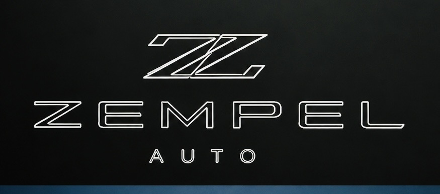

<div align="center">


# Zempel Auto Parts CRM — PartsCommand

Production-grade auto parts inventory, customer, and sales management platform.

*PWA → Cloudflare Worker → FastAPI → RockAuto → Neon PostgreSQL*

<br />

[](https://github.com/TechGuruServices/zempel-auto-crm)
[](https://opensource.org/licenses/MIT)
[](https://www.python.org/)
[](https://workers.cloudflare.com/)
[](https://neon.tech/)

</div>

---

## 🌟 Overview

**Zempel Auto Parts CRM** is an enterprise-grade solution engineered to handle inventory, customer tracking, and dynamic parts sourcing seamlessly. Leveraging a cutting-edge serverless architecture, i[...]

### Key Features
- **📦 Inventory Management** — CRUD operations, barcode scanning via QR reader, and low-stock alerts.
- **👥 Customer Tracking** — Contact details, loyalty points, and purchase history.
- **🚗 Vehicle Registry** — Make, model, year, and VIN tracking, seamlessly linked to customers and service records.
- **💰 Sales & Estimates** — Real-time line-item invoices, robust PDF exports (`jsPDF`), and dynamic margin calculations.
- **⚡ Live Price Comparison** — Direct integration with RockAuto via a hardened proxy pipeline.
- **🔒 Audit Logging** — Immutable, structured JSONB logs directly stored in Neon PostgreSQL.

---

## 🏗️ Architecture

The platform follows a highly resilient, offline-first microservices architecture:

```mermaid
graph LR
  A[📱 PWA Frontend\nCloudflare Pages] <--> B[🛡️ CF Worker Proxy\nKV Cache & Rate Limit]
  B <--> C[🐍 Python FastAPI\nKoyeb]
  C <--> D[🛒 RockAuto API\nScraper]
  C --> E[(🐘 Neon PG\nAudit Logs)]
