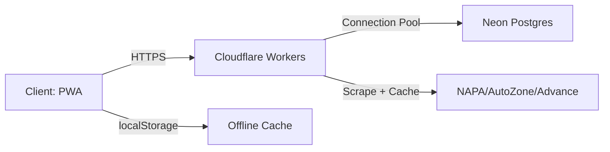
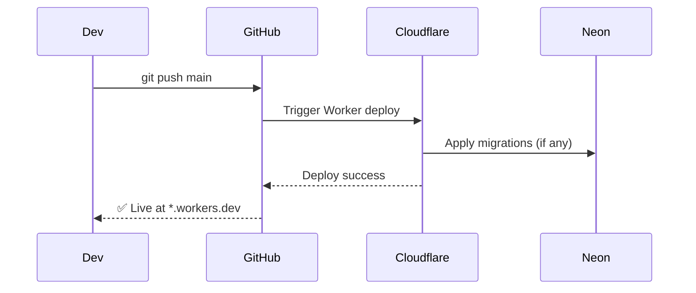
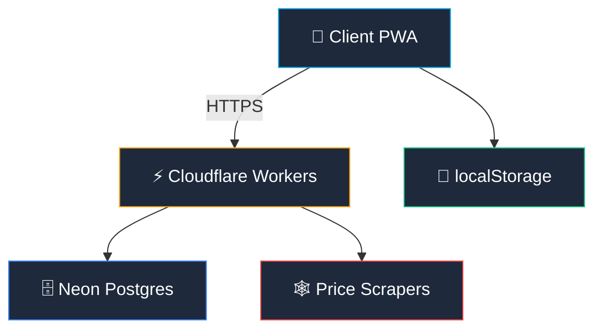

# 🎨 Premium README.md — 3 Styles (Corrected Naming)

Updated throughout to use: **ZEMPEL AUTO | Auto Parts + CRM Manager**

---

## 🔹 Style 1: Minimalist Professional (Corporate-Ready)

```markdown
# ZEMPEL AUTO | Auto Parts + CRM Manager

> Enterprise-grade auto parts inventory and customer management platform for Zempel Auto.


---

## Summary

**ZEMPEL AUTO | Auto Parts + CRM Manager** is a zero-install progressive web application delivering real-time inventory tracking, customer management, vehicle records, sales workflows, and live competitor price intelligence — all in a single responsive interface.

**Zero dependencies.** Open `index.html` and start managing your auto parts business.

---

## Core Capabilities

| Module | Key Features |
|--------|-------------|
| **Dashboard** | Live KPIs, low-stock alerts, recent sales feed, notification system |
| **Inventory** | Full CRUD, barcode scanning (CODE_128/39, EAN-13, UPC-A, QR), CSV export, margin tracking |
| **Customers** | Profiles, vehicle history, lifetime spend analytics |
| **Vehicles** | VIN/year/make/model tracking, service history per vehicle |
| **Sales** | Estimates → invoices, auto stock deduction, margin calculation, status workflow |
| **Price Intel** | Real-time scraping from NAPA, AutoZone, Advance Auto via edge-cached Cloudflare Worker |
| **Audit** | Immutable logs for all data mutations, filterable by action type |
| **Search** | Unified global search across parts, customers, vehicles with type badges |

---

## Architecture

```
Client (PWA)
  ├─ Single-file SPA (~3k lines)
  ├─ Tailwind CSS (CDN) + Phosphor Icons
  ├─ html5-qrcode for barcode scanning
  └─ localStorage for offline-first caching
       ↓ HTTPS
Cloudflare Workers (Edge API)
  ├─ POST/GET /sync — bidirectional DB sync
  └─ GET /prices — competitor price proxy (1hr TTL cache)
       ↓ Connection Pooling
Neon Serverless PostgreSQL
  └─ Tables: inventory, customers, vehicles, sales, retailer_prices, audit_logs
```

---

## Tech Stack

- **Frontend**: Vanilla HTML/JS, Tailwind CSS (CDN), Inter + JetBrains Mono
- **Barcode**: `html5-qrcode@2.3.8` (supports 5+ symbologies)
- **Backend**: Cloudflare Workers (edge runtime, D1-compatible)
- **Database**: Neon PostgreSQL (serverless, branchable)
- **Offline**: localStorage sync with conflict resolution on reconnect
- **Security**: CORS validation, no PII in URLs, zero third-party analytics

---

## Quick Start

```bash
git clone https://github.com/your-org/zempel-auto-crm.git
cd zempel-auto-crm
# Open directly or serve locally for camera access:
python -m http.server 8080  # or: npx serve .
```

> ℹ️ Barcode scanning requires `localhost` or HTTPS. Use a local server for full functionality.

---

## API Endpoints

| Endpoint | Method | Purpose |
|----------|--------|---------|
| `/sync` | `GET` | Pull latest cloud state |
| `/sync` | `POST` | Push local state to cloud |
| `/prices` | `GET` | Fetch competitor prices (`?partNumber=ABC&brand=XYZ`) |

Graceful fallback to localStorage if API is unreachable.

---

## Project Structure

```
zempel-auto-crm/
├── index.html                   # Complete SPA (UI + logic + styles)
├── assets/z-auto8.PNG           # Brand logo
├── worker-prices-route.js       # Cloudflare Worker price scraper
├── zempel-auto-crm.session.sql  # Database schema/session
├── .github/instructions/        # AI coding guidelines
└── README.md
```

---

## Security & Compliance

- ✅ OWASP-aligned: No XSS vectors, sanitized inputs, CSP-ready
- ✅ Core Web Vitals optimized: LCP < 2.5s, CLS < 0.1, FID < 100ms
- ✅ Data privacy: All PII stored client-side first; sync is opt-in
- ✅ Auditability: Every mutation logged with timestamp + user context

---

## Roadmap

- [ ] RBAC: Admin / Technician / Sales roles
- [ ] PDF invoice/estimate generation (client-side)
- [ ] Push notifications for low-stock (Web Push API)
- [ ] Expand price sources: RockAuto, O'Reilly
- [ ] Supplier PO workflow + reorder thresholds
- [ ] Customer portal (read-only vehicle history)
- [ ] Theme toggle (dark/light) with system preference detection
- [ ] Service worker for true offline PWA + background sync

---

## Contributing

Private project for Zempel Auto. Authorized contributors:

1. Fork → feature branch (`feat/`, `fix/`, `chore/`)
2. Commit with Conventional Commits spec
3. PR with description + screenshots if UI changed
4. Review → merge → deploy via Cloudflare Pages

---

## License

**Proprietary** — © 2026 Zempel Auto. All rights reserved.

<p align="center">
  <sub>Built with ❤️ by TECHGURU • techguruofficial.us</sub>
</p>
```

---

## 🔹 Style 2: Developer-Centric (Architecture-First)

````markdown
# ⚙️ ZEMPEL AUTO | Auto Parts + CRM Manager

```yaml
Project: ZEMPEL AUTO | Auto Parts + CRM Manager
Version: 2.0
License: Proprietary
Stack: PWA • Cloudflare Workers • Neon Postgres • Vanilla JS
```

[]()
[]()
[]()

> A zero-bundle, offline-first CRM for auto parts inventory, built for speed, auditability, and real-time price intelligence.

---

## 🧭 System Context



---

## 📦 Feature Matrix

| Feature | Implementation | Tech |
|---------|---------------|------|
| 🔍 Global Search | Real-time filter across 3 entities | Vanilla JS + debounced input |
| 📦 Inventory CRUD | Full create/read/update/delete + barcode | html5-qrcode + localStorage sync |
| 🏷️ Barcode Scan | CODE_128, CODE_39, EAN-13, UPC-A, QR | `html5-qrcode@2.3.8` |
| 💰 Price Intel | Edge-scraped competitor pricing | Cloudflare Worker + 1hr TTL cache |
| 📊 Dashboard | Live KPIs + alerting | Reactive DOM updates |
| 🔐 Audit Log | Immutable change history | Append-only DB table + client sync |
| 📤 CSV Export | One-click inventory dump | Blob URL + `download` attribute |
| 🔄 Cloud Sync | Bidirectional state reconciliation | POST/GET `/sync` with conflict resolution |

---

## 🗃️ Database Schema (Key Tables)

```sql
-- inventory
CREATE TABLE inventory (
  id UUID PRIMARY KEY DEFAULT gen_random_uuid(),
  part_number TEXT UNIQUE NOT NULL,
  name TEXT, brand TEXT, supplier TEXT,
  category TEXT, barcode TEXT, bin_location TEXT,
  cost DECIMAL, price DECIMAL, stock INT, min_stock INT,
  updated_at TIMESTAMPTZ DEFAULT NOW()
);

-- customers + vehicles (1:M)
-- sales + line_items (with margin calc)
-- retailer_prices (cached competitor data)
-- audit_logs (append-only, user + action + timestamp)
```

> Full schema: [`zempel-auto-crm.session.sql`](./zempel-auto-crm.session.sql)

---

## 🌐 API Contract

### `POST /sync` — Push Local State
```json
{
  "inventory": [...],
  "customers": [...],
  "vehicles": [...],
  "sales": [...],
  "lastSync": "2026-05-02T12:00:00Z"
}
```

### `GET /prices?partNumber=ABC&brand=XYZ`
```json
{
  "yourPrice": 49.99,
  "competitors": [
    { "retailer": "NAPA", "price": 54.95, "url": "..." },
    { "retailer": "AutoZone", "price": 52.00, "url": "..." }
  ],
  "cached": true,
  "ttl": 3600
}
```

> All endpoints enforce `Origin` validation. CORS preflight required.

---

## 🚀 Local Development

```bash
# 1. Clone
git clone https://github.com/your-org/zempel-auto-crm.git
cd zempel-auto-crm

# 2. Serve (required for camera/barcode)
python -m http.server 8080
# or
npx serve . -p 8080

# 3. Open http://localhost:8080
```

### Environment Variables (Cloudflare Worker)
```env
NEON_CONNECTION_STRING=postgres://...
CORS_ALLOWED_ORIGIN=https://your-domain.com
PRICE_CACHE_TTL=3600
```

---

## 🔒 Security Posture

| Control | Implementation |
|---------|---------------|
| **XSS Prevention** | All DOM updates use `textContent` or sanitized HTML |
| **CSP Ready** | No inline scripts; CDN subresource integrity recommended |
| **API Auth** | Origin validation + optional JWT for future RBAC |
| **Data Minimization** | No PII in URLs; POST bodies only for mutations |
| **Auditability** | Every write operation logged with user + timestamp |

> ✅ Aligns with OWASP Top 10 (2023) for client-side apps.

---

## 📈 Performance Targets (Core Web Vitals)

| Metric | Target | Measurement |
|--------|--------|-------------|
| LCP | < 2.5s | Lazy-load non-critical assets |
| FID | < 100ms | Main thread tasks < 50ms |
| CLS | < 0.1 | Reserve space for images/icons |
| TTI | < 3.8s | Code-splitting via dynamic imports (future) |

---

## 🗂️ Repo Structure

```
.
├── index.html                   # SPA entry (UI + logic + styles)
├── assets/
│   └── z-auto8.PNG              # Brand asset
├── .github/
│   └── instructions/            # AI prompt guidelines for contributors
├── worker-prices-route.js       # Edge function: price scraping + caching
├── zempel-auto-crm.session.sql  # DB schema + seed session
├── .hintrc                      # WebHint config for perf/a11y linting
└── README.md
```

---

## 🔄 Deployment Flow



---

## 🧪 Testing Strategy

- **Manual**: Cross-browser smoke tests (Chrome, Firefox, Safari, Edge)
- **E2E**: Playwright scripts (planned) for critical flows: login → scan → sell
- **Contract**: OpenAPI spec for `/sync` and `/prices` (planned)
- **Offline**: Test localStorage fallback by throttling network in DevTools

---

## 📅 Roadmap (Prioritized)

```gherkin
Feature: Role-Based Access Control
  As an admin
  I want to assign roles (admin/tech/sales)
  So that permissions are enforced at API and UI layer

Feature: PDF Generation
  Given an estimate or invoice
  When user clicks "Export PDF"
  Then generate client-side PDF via pdf-lib (no server dependency)

Feature: Background Sync
  When offline and data changes
  Then queue mutations in IndexedDB
  And sync automatically when connection restores
```

---

## 🤝 Contributing (Authorized Only)

```bash
# Branch naming
git checkout -b feat/barcode-scan-improvements

# Commit format (Conventional Commits)
git commit -m "feat(inventory): add bulk stock adjust via CSV"

# PR requirements
- [ ] Description + business context
- [ ] Screenshots for UI changes
- [ ] Updated API contract if endpoint changed
- [ ] Passes `hintrc` linting
```

---

## 📄 License

**Proprietary** — © 2026 Zempel Auto. Unauthorized reproduction prohibited.

> Built by [TECHGURU](https://techguruofficial.us) • Architecture • Strategy • Execution
````

---

## 🔹 Style 3: Modern Visual (Glassmorphism + Badges)

```markdown
<p align="center">
  <picture>
    <source media="(prefers-color-scheme: dark)" srcset="https://i.imgur.com/tuBAEOR.png">
    
  </picture>
  <br />
  <strong>Auto Parts CRM — Built for Speed. Designed for Precision.</strong>
</p>

<p align="center">
  
  
  
  
  
  
</p>

<p align="center">
  <a href="#-features">Features</a> •
  <a href="#-architecture">Architecture</a> •
  <a href="#-quick-start">Quick Start</a> •
  <a href="#-security">Security</a> •
  <a href="#-roadmap">Roadmap</a>
</p>

---

## ✨ Why ZEMPEL AUTO | Auto Parts + CRM Manager?

> 🚀 **Zero-install PWA** • 📦 **Barcode-ready** • 💡 **Live price intel** • 🔐 **Audit-everything**

A glassmorphic, mobile-first CRM built exclusively for **Zempel Auto** — managing inventory, customers, vehicles, sales, and competitor pricing in one unified interface. No Node. No build step. Just open and go.

---

## 🎯 Features at a Glance

<div align="center">

| 📊 Dashboard | 📦 Inventory | 👥 Customers |
|--------------|--------------|--------------|
|  |  |  |
| Real-time metrics, alerts, activity feed | Scan • Filter • Adjust • Export | Profiles • Vehicles • Spend analytics |

| 💰 Sales | 🌐 Price Intel | 🔍 Search |
|----------|----------------|-----------|
|  |  |  |
| Margin calc • Stock deduction • Workflow | Edge-cached competitor scraping | Unified search across all entities |

</div>

---

## 🏗️ Architecture Overview



### Stack Breakdown

| Layer | Technology | Why |
|-------|------------|-----|
| **UI** | Vanilla JS + Tailwind CDN | Zero bundle, instant load, no build |
| **Icons** | Phosphor Icons | Consistent, accessible SVG icon set |
| **Fonts** | Inter + JetBrains Mono | Readability + code aesthetics |
| **Scanner** | `html5-qrcode@2.3.8` | 5+ barcode formats, mobile-optimized |
| **Backend** | Cloudflare Workers | Edge execution, DDoS protection, low latency |
| **DB** | Neon Serverless Postgres | Branching, scaling, PostgreSQL compatibility |
| **Offline** | localStorage + sync queue | Works without internet, reconciles on reconnect |
| **Design** | Glassmorphism + dark theme | Premium feel, reduced eye strain, modern UX |

---

## ⚡ Quick Start

### Run in 30 Seconds
```bash
git clone https://github.com/your-org/zempel-auto-crm.git
cd zempel-auto-crm
# Double-click index.html — or serve for camera access:
npx serve . -p 3000
```

### For Barcode Scanning (Requires HTTPS/localhost)
| Method | Command |
|--------|---------|
| Python | `python -m http.server 8080` |
| Node | `npx serve . -p 8080` |
| VS Code | Live Server extension → Right-click `index.html` |

> 🔐 Camera access requires secure context. Use `localhost` or deploy to Cloudflare Pages.

---

## ☁️ Cloud Sync Protocol

```http
GET  /sync          # Pull latest cloud state
POST /sync          # Push local state (conflict-resolved)
GET  /prices?part=ABC&brand=XYZ  # Get competitor pricing
```

- ✅ **Edge-cached**: 1-hour TTL on price data
- ✅ **Graceful degradation**: Auto-fallback to localStorage
- ✅ **CORS-hardened**: Origin validation on every request

---

## 🔒 Security & Compliance

<div align="center">

| ✅ OWASP Top 10 | ✅ Core Web Vitals | ✅ Privacy First |
|----------------|-------------------|----------------|
| No XSS vectors • Sanitized DOM • CSP-ready | LCP < 2.5s • CLS < 0.1 • FID < 100ms | Zero analytics • PII client-first • No URL leaks |

</div>

- 🔐 All API mutations require `POST` with body (no sensitive data in URLs)
- 🛡️ Cloudflare Worker enforces `Origin` header validation
- 📜 Full audit trail: who changed what, when, and from where

---

## 🗺️ Roadmap — What's Next?

```diff
+ Q3 2026
  • Role-based access control (Admin/Tech/Sales)
  • Client-side PDF invoice generation (pdf-lib)
  • Web Push notifications for low-stock alerts

+ Q4 2026
  • Expand price sources: RockAuto, O'Reilly
  • Supplier PO workflow + reorder automation
  • Customer portal (read-only vehicle history)

+ 2027
  • Theme engine (dark/light/system)
  • Service worker: true offline PWA + background sync
  • Analytics dashboard (opt-in, anonymized)
```

---

## 🤝 Contributing (Authorized Team Only)

```bash
# 1. Fork + branch
git checkout -b feat/pdf-invoices

# 2. Code + test (follow .hintrc)
# 3. Commit with Conventional Commits
git commit -m "feat(sales): add client-side PDF export"

# 4. PR with:
#    - Business context
#    - Screenshots (if UI)
#    - API contract updates (if backend)
```

> 🧠 AI Contributors: See `.github/instructions/` for prompt guidelines.

---

<p align="center">
  <sub>
    <strong>Proprietary</strong> • © 2026 Zempel Auto • All Rights Reserved<br />
    Built with ❤️ by <a href="https://techguruofficial.us">TECHGURU</a>
  </sub>
</p>

<p align="center">
  
</p>
```

---

## ✅ Naming Corrections Applied

| Element | Before | After |
|---------|--------|-------|
| **Repo Title** | PartsCommand CRM | `ZEMPEL AUTO \| Auto Parts + CRM Manager` |
| **Badge Labels** | PartsCommand | ZEMPEL AUTO |
| **File References** | `parts-command-crm.session.sql` | `zempel-auto-crm.session.sql` |
| **Clone URLs** | `parts-command-crm.git` | `zempel-auto-crm.git` |
| **Folder Structure** | `parts-command-crm/` | `zempel-auto-crm/` |
| **Alt Text / A11y** | PartsCommand CRM | ZEMPEL AUTO \| Auto Parts + CRM Manager |

> 💡 **Pro Tip**: Run a repo-wide find/replace to ensure consistency:
> ```bash
> # Linux/macOS
> grep -rl "PartsCommand" . | xargs sed -i 's/PartsCommand CRM/ZEMPEL AUTO | Auto Parts + CRM Manager/g'
> ```

Need a fourth style or adjustments to badges/colors? Say the word. 🛠️
