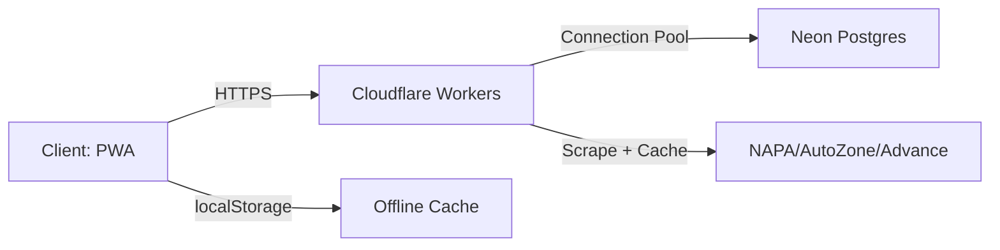
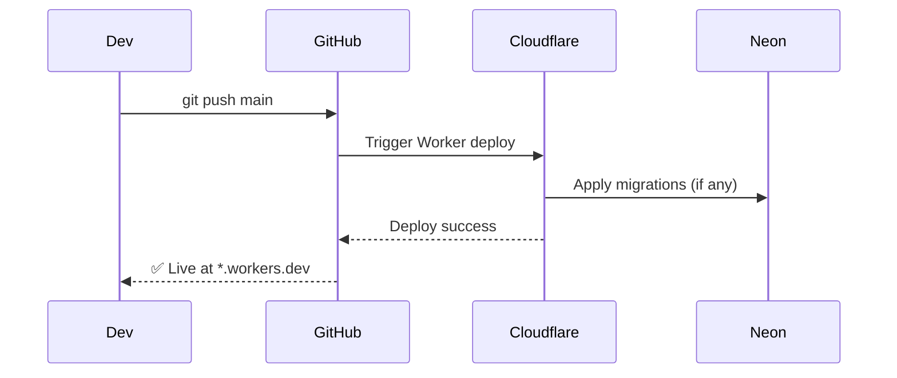

# ⚙️ ZEMPEL AUTO | Auto Parts + CRM Manager

```yaml
Project: ZEMPEL AUTO | Auto Parts + CRM Manager
Version: 2.0
License: Proprietary
Stack: PWA • Cloudflare Workers • Neon Postgres • Vanilla JS
```

[]()
[]()
[]()

> A zero-bundle, offline-first CRM for auto parts inventory, built for speed, auditability, and real-time price intelligence.

---

## 🧭 System Context



---

## 📦 Feature Matrix

| Feature | Implementation | Tech |
|---------|---------------|------|
| 🔍 Global Search | Real-time filter across 3 entities | Vanilla JS + debounced input |
| 📦 Inventory CRUD | Full create/read/update/delete + barcode | html5-qrcode + localStorage sync |
| 🏷️ Barcode Scan | CODE_128, CODE_39, EAN-13, UPC-A, QR | `html5-qrcode@2.3.8` |
| 💰 Price Intel | Edge-scraped competitor pricing | Cloudflare Worker + 1hr TTL cache |
| 📊 Dashboard | Live KPIs + alerting | Reactive DOM updates |
| 🔐 Audit Log | Immutable change history | Append-only DB table + client sync |
| 📤 CSV Export | One-click inventory dump | Blob URL + `download` attribute |
| 🔄 Cloud Sync | Bidirectional state reconciliation | POST/GET `/sync` with conflict resolution |

---

## 🗃️ Database Schema (Key Tables)

```sql
-- inventory
CREATE TABLE inventory (
  id UUID PRIMARY KEY DEFAULT gen_random_uuid(),
  part_number TEXT UNIQUE NOT NULL,
  name TEXT, brand TEXT, supplier TEXT,
  category TEXT, barcode TEXT, bin_location TEXT,
  cost DECIMAL, price DECIMAL, stock INT, min_stock INT,
  updated_at TIMESTAMPTZ DEFAULT NOW()
);

-- customers + vehicles (1:M)
-- sales + line_items (with margin calc)
-- retailer_prices (cached competitor data)
-- audit_logs (append-only, user + action + timestamp)
```

> Full schema: [`zempel-auto-crm.session.sql`](./zempel-auto-crm.session.sql)

---

## 🌐 API Contract

### `POST /sync` — Push Local State
```json
{
  "inventory": [...],
  "customers": [...],
  "vehicles": [...],
  "sales": [...],
  "lastSync": "2026-05-02T12:00:00Z"
}
```

### `GET /prices?partNumber=ABC&brand=XYZ`
```json
{
  "yourPrice": 49.99,
  "competitors": [
    { "retailer": "NAPA", "price": 54.95, "url": "..." },
    { "retailer": "AutoZone", "price": 52.00, "url": "..." }
  ],
  "cached": true,
  "ttl": 3600
}
```

> All endpoints enforce `Origin` validation. CORS preflight required.

---

## 🚀 Local Development

```bash
# 1. Clone
git clone https://github.com/your-org/zempel-auto-crm.git
cd zempel-auto-crm

# 2. Serve (required for camera/barcode)
python -m http.server 8080
# or
npx serve . -p 8080

# 3. Open http://localhost:8080
```

### Environment Variables (Cloudflare Worker)
```env
NEON_CONNECTION_STRING=postgres://...
CORS_ALLOWED_ORIGIN=https://your-domain.com
PRICE_CACHE_TTL=3600
```

---

## 🔒 Security Posture

| Control | Implementation |
|---------|---------------|
| **XSS Prevention** | All DOM updates use `textContent` or sanitized HTML |
| **CSP Ready** | No inline scripts; CDN subresource integrity recommended |
| **API Auth** | Origin validation + optional JWT for future RBAC |
| **Data Minimization** | No PII in URLs; POST bodies only for mutations |
| **Auditability** | Every write operation logged with user + timestamp |

> ✅ Aligns with OWASP Top 10 (2023) for client-side apps.

---

## 📈 Performance Targets (Core Web Vitals)

| Metric | Target | Measurement |
|--------|--------|-------------|
| LCP | < 2.5s | Lazy-load non-critical assets |
| FID | < 100ms | Main thread tasks < 50ms |
| CLS | < 0.1 | Reserve space for images/icons |
| TTI | < 3.8s | Code-splitting via dynamic imports (future) |

---

## 🗂️ Repo Structure

```
.
├── index.html                   # SPA entry (UI + logic + styles)
├── assets/
│   └── z-auto8.PNG              # Brand asset
├── .github/
│   └── instructions/            # AI prompt guidelines for contributors
├── worker-prices-route.js       # Edge function: price scraping + caching
├── zempel-auto-crm.session.sql  # DB schema + seed session
├── .hintrc                      # WebHint config for perf/a11y linting
└── README.md
```

---

## 🔄 Deployment Flow



---

## 🧪 Testing Strategy

- **Manual**: Cross-browser smoke tests (Chrome, Firefox, Safari, Edge)
- **E2E**: Playwright scripts (planned) for critical flows: login → scan → sell
- **Contract**: OpenAPI spec for `/sync` and `/prices` (planned)
- **Offline**: Test localStorage fallback by throttling network in DevTools

---

## 📅 Roadmap (Prioritized)

```gherkin
Feature: Role-Based Access Control
  As an admin
  I want to assign roles (admin/tech/sales)
  So that permissions are enforced at API and UI layer

Feature: PDF Generation
  Given an estimate or invoice
  When user clicks "Export PDF"
  Then generate client-side PDF via pdf-lib (no server dependency)

Feature: Background Sync
  When offline and data changes
  Then queue mutations in IndexedDB
  And sync automatically when connection restores
```

---

## 🤝 Contributing (Authorized Only)

```bash
# Branch naming
git checkout -b feat/barcode-scan-improvements

# Commit format (Conventional Commits)
git commit -m "feat(inventory): add bulk stock adjust via CSV"

# PR requirements
- [ ] Description + business context
- [ ] Screenshots for UI changes
- [ ] Updated API contract if endpoint changed
- [ ] Passes `hintrc` linting
```

---

## 📄 License

**Proprietary** — © 2026 Zempel Auto. Unauthorized reproduction prohibited.

> Built by [TECHGURU](https://techguruofficial.us) • Architecture • Strategy • Execution

> https://techguruofficial.us/images/icons/nav-icon-new.webp | Engineered Efficiency. Designed for Impact.
