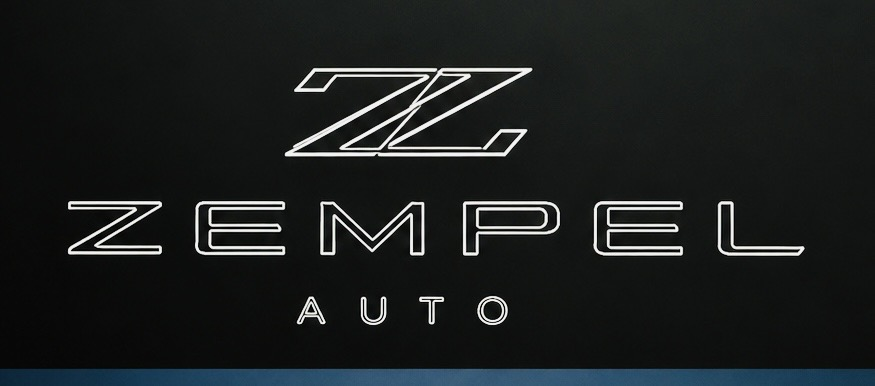
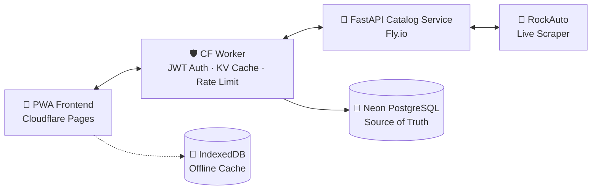

<div align="center">


# Zempel Auto Parts CRM — PartsCommand

**The all-in-one shop management platform for Zempel Auto** — inventory, customers, vehicles, sales, invoices, and live parts sourcing in a single installable web app.

*PWA → Cloudflare Workers → Fly.io FastAPI → RockAuto → Neon PostgreSQL*

<br />

[](https://github.com/TechGuruServices/zempel-auto-crm)
[](https://zempel-auto-crm.pages.dev)
[](https://zempel-auto-crm.pages.dev)
[](https://fly.io)
[](https://neon.tech)

**🌐 Live app:** [zempel-auto-crm.pages.dev](https://zempel-auto-crm.pages.dev)

</div>

---

## ✨ What it does

PartsCommand runs the day-to-day of an auto parts business from any phone, tablet, or desktop:

| Module | Capabilities |
|---|---|
| 📦 **Inventory** | Full CRUD, barcode/QR scanning, low-stock alerts, live price refresh |
| 👥 **Customers** | Contact records, loyalty points, purchase & service history. **Total Spent is derived live from the completed-sales ledger** — it can never drift out of sync |
| 🚗 **Vehicles** | Year/make/model/VIN/mileage registry linked to customers, with per-vehicle service records (add, edit, delete) |
| 💰 **Sales & Estimates** | Line items, labor, tax, margin calculation, status workflow (pending → completed), editable at any time |
| ⚖️ **Price Comparison** | Side-by-side pricing across RockAuto, O'Reilly, NAPA, AutoZone, Advance, and Carquest against your own price |
| 🧾 **Invoices** | Create, edit, delete, PDF download/print, share via email or SMS |
| 🔧 **RockAuto Catalog** | Live makes → years → models → engines → categories → parts lookup |
| 📊 **Dashboard** | Sales analytics, quick-sale actions, KPIs at a glance |
| 🧭 **Audit Logs** | Immutable JSONB event log in PostgreSQL — who changed what, when |
| 📴 **Offline-first** | Local cache + offline queue; the shop keeps running without a connection |

Every record — customers, vehicles, sales, invoices — is **editable and deletable from its own screen**. No dead ends.

---

## 🏗️ Architecture

Offline-first, serverless, and cheap to run:


```mermaid
graph LR
  A[📱 PWA Frontend<br/>Cloudflare Pages] <--> B[🛡️ CF Worker<br/>JWT Auth · KV Cache · Rate Limit]
  B <--> C[🐍 FastAPI Catalog Service<br/>Fly.io]
  C <--> D[🛒 RockAuto<br/>Live Scraper]
  B --> E[(🐘 Neon PostgreSQL<br/>Source of Truth)]
  A -.-> F[(💾 IndexedDB<br/>Offline Cache)]
```

- **Frontend** — single-page PWA (vanilla JS + Tailwind), glassmorphism design system, self-hosted fonts, installable on iOS/Android/desktop.
- **Worker** (`parts-command-api`) — TypeScript Cloudflare Worker: JWT authentication, request proxying with KV caching, rate limiting, and the Neon sync API.
- **Catalog service** — Python FastAPI on Fly.io wrapping the RockAuto scraper; auto-deploys from its repo on push.
- **Database** — Neon PostgreSQL is the source of truth; clients hydrate from IndexedDB instantly, then reconcile with cloud data.

---

## 🧰 Tech stack

| Layer | Technology |
|---|---|
| Frontend | Vanilla JS, Tailwind CSS, PWA (service worker + manifest) |
| API / Auth | Cloudflare Workers (TypeScript), JWT |
| Catalog | Python 3.11+, FastAPI, RockAuto scraper |
| Database | Neon PostgreSQL (JSONB) |
| Hosting | Cloudflare Pages (app) · Fly.io (catalog) |
| Client storage | IndexedDB via localForage (offline cache + queue) |
| PDFs | jsPDF + autoTable |

---

## 📁 Project structure

```
├── frontend/            # The PWA — index.html + modular JS (invoices, auth,
│                        #   rockauto catalog, price sync, offline queue…)
├── src/                 # Python FastAPI catalog service (deployed to Fly.io)
├── rockauto-api-main/   # RockAuto scraper library (pinned via requirements)
├── backend/             # Legacy worker reference (see src/ for the live TS build)
├── cloudflare-proxy/    # Proxy route maps + docs
├── deploy/              # Deployment helpers
├── Dockerfile           # Catalog service container
└── CHANGES.md           # Engineering change log
```

---

## 🚀 Getting started

### Frontend (Cloudflare Pages)
The app is fully static — connect this repo's `frontend/` directory in the Cloudflare Pages dashboard (or `npx wrangler pages deploy frontend/`). No build step.

### Worker API
```bash
npx wrangler deploy        # from the worker project
# Required secrets:
npx wrangler secret put SERVICE_AUTH_KEY     # shared key for the catalog service
npx wrangler secret put PYTHON_SERVICE_URL   # e.g. https://<app>.fly.dev
```
KV namespaces: bind a KV store for catalog response caching and one for rate limiting.

### Catalog service (Fly.io)
```bash
fly launch                 # first time
fly deploy                 # or push — the repo is wired for auto-deploy
```

### Environment summary
| Variable | Where | Purpose |
|---|---|---|
| `SERVICE_AUTH_KEY` | Worker + Fly app | Authenticates worker → catalog calls |
| `PYTHON_SERVICE_URL` | Worker | Base URL of the Fly.io catalog service |

---

## 🔑 Data integrity notes

- **Total Spent is computed, not stored.** Customer spend is derived from the completed-sales ledger (+ an optional manual opening balance) on every read and every write — completing a sale twice can't double-count, and deleting a sale can't leave phantom spend.
- **Cloud is the source of truth.** Local IndexedDB gives instant loads and offline operation; every mutation syncs to Neon, and conflicts resolve toward the server.
- **No fabricated prices.** Offline fallbacks never invent pricing — unavailable live data is labeled as such.

---

## 📦 Recent releases

- **v3.7.1** — Header collapses to zero height when hidden (reclaims screen space); version bumped across app, service worker, and About.
- **v3.7.0** — Glass design system refresh, new dashboard, self-hosted fonts, tablet rail.
- **v3.1.0** — Prior stable baseline.

See [CHANGES.md](./CHANGES.md) for the detailed engineering log.

---

## 📄 License

All rights reserved — Zempel Auto. Contact the repository owner for licensing inquiries.
</div>
